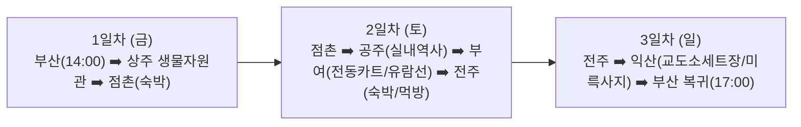

# 🚗 [여행 계획서] 아빠와 초5 아들의 2박 3일 백제 탐방 & 액티비티 여행

> **대상**: 아빠 + 초등학교 5학년 남자아이 (2인)  
> **기간**: 2박 3일 (금요일 14:00 부산 출발 ~ 일요일 17:00 부산 복귀)  
> **핵심 콘셉트**:  
> 1. **무더위 타파**: 땡볕 장시간 도보 0% (실내 에어컨 쾌적 관람 + 지붕 달린 전동카트/유람선 등 탈것 중심)  
> 2. **초5 맞춤형 재미**: 지루한 박물관 해설 대신 3D VR/미디어아트, 옛 궁궐 전동카트 드라이브, 영화 세트장 죄수복 상황극, 야시장 먹방  
> 3. **안전 제일**: 위험한 익스트림(루지 등) 제외, 검증된 안전 시설 이용  
> 4. **현실적인 동선**: 네비게이션 실주행 시간 및 최신 도로망 반영  

---

## 🗺️ 전체 여행 동선 개요

---

## 📅 [1일차 / 금요일] 부산 출발 ➡️ 안전한 실내 체험 ➡️ 점촌 숙박

* **목표**: 이동 피로를 줄이고, 점촌 도착 전 시원한 실내에서 가볍게 탐방 후 맛있는 저녁 식사

| 시간 | 장소 / 일정 | 소요 시간 / 이동 | 주요 내용 & 팁 |
| :--- | :--- | :--- | :--- |
| **14:00** | **부산 출발** | - | 중부내륙고속도로 라인 이용 |
| **16:20 ~ 17:40** | **[경유] 국립낙동강생물자원관** (경북 상주시) | 2시간 20분 주행 후 도착 | • 점촌 도착 20분 전 위치 (우회 최소화) • 초대형 실내 에어컨 전시관 (실물 크기 동물 박제 디오라마, AR 실감 체험) • 초등학생 만족도가 높은 안전한 국립 시설 |
| **17:40 ~ 18:05** | **상주 ➡️ 점촌(모전동) 이동** | 약 20~25분 이동 | 국도 이용 |
| **18:10** | **점촌 숙소 체크인** | - | 짐 풀기 및 휴식 |
| **18:30 ~ 20:00** | **저녁 식사** | 점촌 시내 | 문경 특산 **약돌돼지 삼겹살 / 고추장 석쇠구이** 맛보기 |

---

## 📅 [2일차 / 토요일] 점촌 ➡️ 공주(오전) ➡️ 부여(오후) ➡️ 전주 숙박

* **목표**: 백제 2대 수도(공주 웅진백제 ➡️ 부여 사비백제) 정복. 오전엔 에어컨 실내 관람, 오후엔 탈것으로 시원하게 관람

| 시간 | 장소 / 일정 | 소요 시간 / 이동 | 주요 내용 & 팁 |
| :--- | :--- | :--- | :--- |
| **08:40** | **점촌 숙소 출발** | - | 서산영덕고속도로(청주-상주) 이용 (공산성 주차장 설정) |
| **10:35 ~ 11:30** | **[공주 1] 공산성 고마열차 (순환 관광열차)** | **1시간 55분 이동 후 도착** (체류 55분) | • **덜컹거리는 귀여운 고마열차 타고 공주 명소 순환 드라이브 (약 40분)** • 코스: 공산성 ➡️ 무령왕릉원 ➡️ 공주한옥마을 ➡️ 공산성 • 요금: 어른 3,000원 / 초등학생 1,000원 (현장 발권) • 강바람 맞으며 편안하게 세계유산 둘러보기 & 금서루 포토존 |
| **11:30 ~ 12:10** | **[공주 2] 베이커리 밤마을 (알밤 디저트 타임)** | 공산성 정문 앞 도보 1분 | • **갓 구운 겉바속촉 수제 밤파이** & **밤 에끌레어** & **알밤 젤라또** • 2층 통유리창에서 공산성 뷰 감상하며 시원한 에어컨 힐링 휴식 |
| **12:15 ~ 13:20** | **[공주 3] 100년 전통 공주산성시장 (점심 식사)** | 차로 3분 / 도보 7분 | • **점심 추천**: '단골집' 시원한 비빔국수/잔치국수 or 알밤육회비빔밥 • **시장 명물 간식**: '부자떡집' 알밤모찌, 바삭한 알밤 닭강정 포장 |
| **13:20 ~ 14:00** | **공주 ➡️ 부여 이동** | **약 40분 소요** (약 35km) | 지방도/국도 이동 (국립부여박물관 설정) |
| **14:00 ~ 15:15** | **[부여 1] 국립부여박물관 (백제금동대향로 진품 관람)** | 현장 체류 1시간 15분 | • **국보 제287호 백제금동대향로 진품 실물 단독 전시관 관람** • 로비 천장 돔 **실감 미디어쇼** 관람 (대향로 레이저 영상쇼) • 국보 석조사리감, 규암리 관음보살상 등 백제 사비기 국보 총집합 • **100% 실내 에어컨 & 무료 관람** |
| **15:15 ~ 15:30** | **박물관 ➡️ 백제문화단지 이동** | 약 15분 소요 (약 7km) | 백제교 건너 이동 |
| **15:30 ~ 17:30** | **[부여 2] 백제문화단지 (전기어차 전동카트 투어)** | 현장 체류 2시간 | • **정양문 매표소 부근에서 지붕 달린 4인승 전기어차 대여 (1시간 25,000원)** • 사비궁 천정전, 38m 능사 5층목탑, 위례성, 생활문화마을 여유로운 드라이브 & 인생샷 • 100만평 도읍지를 시원하고 편안하게 탐방 |
| **17:30 ~ 18:25** | **부여 ➡️ 전주 숙소 이동** | **약 55분 소요** (약 60km) | 논산-천안 / 호남고속도로 라인 |
| **18:00 ~** | **전주 숙소 체크인 & 저녁 먹방** | 전주 시내 | • **숙소**: 전주 시내 호텔 (라한호텔, 그랜드힐스턴, 베스트웨스턴 등) • **저녁**: 전주 떡갈비 / 전주비빔밥 / 남부시장 야시장 길거리 음식 투어 |

---

## 📅 [3일차 / 일요일] 전주 ➡️ 익산(오전) ➡️ 부산 복귀 (오후)

* **목표**: 백제 마지막 수도 익산의 이색 포토존 & 실내 박물관 탐방 후 오후 5시 전 부산 귀가

| 시간 | 장소 / 일정 | 소요 시간 / 이동 | 주요 내용 & 팁 |
| :--- | :--- | :--- | :--- |
| **09:30** | **체크아웃 & 전주 출발** | - | 전주 ➡️ 익산 북부 이동 |
| **10:10 ~ 11:10** | **[익산 1] 익산 교도소 세트장** | **약 35~40분 소요** | • **초5 남학생 취향 저격 (영화/드라마 촬영지)** • 죄수복/교도관복 대여 입고 감옥 방탈출/법정 상황극 및 인생샷 촬영 |
| **11:30 ~ 12:40** | **[익산 2] 국립익산박물관 & 미륵사지** | 15분 이동 | • **100% 지하 실내 박물관 (에어컨 완비)** • 백제 무왕의 거대한 미륵사지 석탑 사리장엄구 및 어린이 디지털 인터랙티브 체험 |
| **12:50 ~ 13:50** | **점심 식사 (익산 또는 전주IC 근처)** | 인근 식당 | 익산 황등육회비빔밥 or 시원한 메밀소바/돈가스 |
| **14:00** | **부산으로 출발** | **약 2시간 45분 소요** (약 245km) | 순천완주고속도로 ➡️ 남해고속도로 |
| **16:45 ~ 17:00** | **부산 도착 & 귀가 완료** | - | 여유 있는 일요일 오후 귀가 |

---

## 💡 여행 핵심 체크포인트 & 운영 정보

1. **부여 백제문화단지 전기어차**
   * 입장 매표소(정양문) 통과 직후 **우측 대여 부스**에서 현장 대여 (1시간 25,000원 / 성인 운전면허 필요)
   * 만약 전동차가 모두 대여 중일 경우 단지 내 순환 관광열차인 **'사비로 열차(1인 3,000원)'**로 대체 가능
2. **부여 백마강 유람선(황포돛배)**
   * **탑승처**: 구드래선착장 (네비: 충남 부여군 부여읍 나루터로 72)
   * 낙화암/고란사 왕복 코스로 탑승 시 하선하지 않고 배 위에서 시원하게 경치를 감상 가능
3. **익산 교도소 세트장**
   * **입장료**: 무료 (매주 월요일 휴관, 09:00~18:00)
   * 의상 대여소에서 죄수복/경찰복 대여 가능 (신분증 보관 필요)
4. **소요 시간 검증 데이터**
   * 점촌(모전동) ➡️ 국립공주박물관: 148~150km (서산영덕고속도로 기준 1시간 55분 소요)
   * 익산/전주 ➡️ 부산: 약 245km (순천완주-남해고속도로 기준 2시간 45분~3시간 소요)
