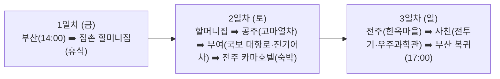

# 🚗 [여행 계획서] 아빠와 초5 아들의 2박 3일 백제 탐방 & 액티비티 여행

> **대상**: 아빠 + 초등학교 5학년 남자아이 (2인)  
> **기간**: 2박 3일 (금요일 14:00 부산 출발 ~ 일요일 17:00 부산 복귀)  
> **핵심 콘셉트**:  
> 1. **무더위 타파**: 땡볕 장시간 도보 0% (실내 에어컨 쾌적 관람 + 지붕 달린 전동카트/유람선 등 탈것 중심)  
> 2. **초5 맞춤형 재미**: 지루한 박물관 해설 대신 3D VR/미디어아트, 옛 궁궐 전동카트 드라이브, 영화 세트장 죄수복 상황극, 야시장 먹방  
> 3. **안전 제일**: 위험한 익스트림(루지 등) 제외, 검증된 안전 시설 이용  
> 4. **현실적인 동선**: 네비게이션 실주행 시간 및 최신 도로망 반영  

---

## 🗺️ 전체 여행 동선 개요

---

## 📅 [1일차 / 금요일] 부산 출발 ➡️ 점촌 할머니집 도착 및 편안한 휴식

* **목표**: 중부내륙고속도로를 타고 정체 전 점촌 할머니집에 도착하여, 할머니께 인사드리고 맛있는 저녁 식사 및 편안한 휴식

| 시간 | 장소 / 일정 | 소요 시간 / 이동 | 주요 내용 & 팁 |
| :--- | :--- | :--- | :--- |
| **14:00** | **부산 출발** | - | 중부내륙고속도로 라인 이용 (약 220~240km) |
| **16:40 ~ 17:00** | **점촌 할머니집 도착** | **약 2시간 40분 ~ 3시간 소요** | • 할머니께 반갑게 인사드리고 짐 풀기 • 여행 첫날 이동 피로 풀며 편안한 휴식 |
| **18:00 ~ 19:30** | **저녁 식사 & 가족 힐링** | 점촌 시내 / 할머니집 | 점촌 시내 맛집 or 할머니 손맛 저녁 식사 |
| **20:00 ~** | **할머니집 휴식 & 백제 여행 준비** | - | 할머니와 도란도란 대화 & 내일 09:30 여유 출발 준비 |

---

## 📅 [2일차 / 토요일] 점촌(할머니집) ➡️ 공주(오전) ➡️ 부여(오후) ➡️ 전주(카마 호텔)

* **목표**: 백제 2대 수도(공주 웅진백제 ➡️ 부여 사비백제) 정복. 오전엔 에어컨 실내 관람, 오후엔 탈것으로 시원하게 관람

| 시간 | 장소 / 일정 | 소요 시간 / 이동 | 주요 내용 & 팁 |
| :--- | :--- | :--- | :--- |
| **09:30** | **점촌 할머니집 출발 (아침 여유 출발)** | - | 서산영덕고속도로(청주-상주) 이용 (공산성 주차장 설정) |
| **11:30 ~ 12:45** | **[공주 1] 100년 전통 공주산성시장 (점심 식사)** | **1시간 55분 이동 후 도착** | • **점심 추천**: '단골집' 시원한 비빔국수/잔치국수 or 알밤육회비빔밥 • **시장 명물 간식**: '부자떡집' 알밤모찌, 바삭한 알밤 닭강정 포장 • 식사 후 공산성 매표소로 이동 (13:00 고마열차 3회차 탑승 준비) |
| **13:00 ~ 13:40** | **[공주 2] 공산성 고마열차 (순환 관광열차 3회차)** | 공산성 매표소 | • **덜컹거리는 귀여운 고마열차 타고 공주 명소 순환 드라이브 (약 40분)** • 코스: 공산성 ➡️ 무령왕릉원 ➡️ 공주한옥마을 ➡️ 국립공주박물관 ➡️ 공산성 • 요금: 어른 3,000원 / 초등학생 1,000원 (현장 무인발권기 선착순) • **운행시간표**: 10:00, 11:00, (12시 미운행), **13:00(★탑승)**, 14:00, 15:00, 16:00, 17:00 |
| **13:45 ~ 14:30** | **공주 ➡️ 부여 이동** | **약 40분 소요** (약 35km) | 지방도/국도 이동 (국립부여박물관 설정) |
| **14:30 ~ 15:45** | **[부여 1] 국립부여박물관 (백제금동대향로 진품 관람)** | 현장 체류 1시간 15분 | • **국보 제287호 백제금동대향로 진품 실물 단독 전시관 관람** • 로비 천장 돔 **실감 미디어쇼** 관람 (대향로 레이저 영상쇼) • 국보 석조사리감, 규암리 관음보살상 등 백제 사비기 국보 총집합 • **100% 실내 에어컨 & 무료 관람** |
| **15:45 ~ 16:00** | **박물관 ➡️ 백제문화단지 이동** | 약 15분 소요 (약 7km) | 백제교 건너 이동 |
| **16:00 ~ 18:00** | **[부여 2] 백제문화단지 (전기어차 전동카트 투어)** | 현장 체류 2시간 | • **정양문 매표소 부근에서 지붕 달린 4인승 전기어차 대여 (1시간 25,000원)** • 사비궁 천정전, 38m 능사 5층목탑, 위례성, 생활문화마을 여유로운 드라이브 & 인생샷 • 100만평 도읍지를 시원하고 편안하게 탐방 (18:00까지 운영) |
| **18:05 ~ 19:00** | **부여 ➡️ 전주 숙소 이동** | **약 55분 소요** (약 60km) | 논산-천안 / 호남고속도로 라인 |
| **19:00 ~ 21:30** | **전주 카마 호텔 체크인 & 남부시장 야시장 먹방** | 전주 시내 (완산구) | • **숙소**: **전주 카마 호텔** 체크인 (프리미엄룸 / 고성능 PC 2대 💻💻, 킹베드 1개, 조식 포함 / 📞 063-229-0051) • **저녁**: 전주 떡갈비 / 전주비빔밥 • **남부시장 야시장** (17:00~23:00 운영): 불초밥, 닭꼬치, 탕후루, 십원빵 등 야시장 먹방 투어 |

---

## 📅 [3일차 / 일요일] 전주 ➡️ 사천(항공우주과학관·전투기 체험) ➡️ 부산 복귀

* **목표**: 전주한옥마을 아침 산책 후 사천 대한민국 항공우주 수도에서 실제 전투기 탑승 & VR 비행 조종 체험 후 오후 5시 전 부산 귀가

| 시간 | 장소 / 일정 | 소요 시간 / 이동 | 주요 내용 & 팁 |
| :--- | :--- | :--- | :--- |
| **09:00 ~ 10:30** | **[전주 1] 전주한옥마을 & 경기전 (아침 산책)** | 도보 이동 | • 고즈넉한 한옥마을 돌담길 & 경기전 태조 이성계 어진 관람 • 울창한 대나무숲 포토존 & PNB 풍년제과 수제 초코파이 선물 포장 |
| **10:30 ~ 12:00** | **전주 ➡️ 사천 이동** | **약 1시간 30분 소요** (약 135km) | 순천완주고속도로 ➡️ 남해고속도로 이용 |
| **12:00 ~ 13:00** | **[사천 1] 점심 식사 (사천 / 진주 맛집)** | 인근 식당 | 사천 삼천포 해물칼국수 or 진주 70년 전통 하연옥 육전냉면 |
| **13:00 ~ 15:00** | **[사천 2] 사천항공우주과학관 & KAI 항공우주박물관** | 현장 체류 2시간 | • **초5 남학생 취향 저격!** (두 곳이 바로 옆에 붙어 있음) • **KAI 항공우주박물관**: 야외 실제 전투기, 수송기, **대통령 전용기 내부 탑승 체험** (어른 2,000원 / 초등 1,000원) • **사천항공우주과학관**: 100% 실내 에어컨! **비행 시뮬레이터 조종, 4D 영상관, 우주인 훈련 VR 체험** (어른 3,000원 / 초등 1,500원) |
| **15:00 ~ 16:30** | **사천 ➡️ 부산 복귀 (귀경)** | **약 1시간 20분 소요** (약 115km) | 남해고속도로 이용 (일요일 오후 상습 정체 전 여유로운 귀가) |
| **16:30 ~ 17:00** | **부산 도착 & 2박 3일 여행 완료!** | - | 공주-부여-전주-사천 백제·과학 문화 여행 성공적 마무리 👏 |

---

## 💡 여행 핵심 체크포인트 & 운영 정보

1. **공주 공산성 고마열차**
   * **운행 시간표**: 10:00, 11:00, (12:00 미운행), 13:00, 14:00, 15:00, 16:00, 17:00 (1일 7회 / 약 40분 순환)
   * 산성시장에서 11:30~12:45 점심 식사 후 **13:00(3회차)** 탑승이 가장 최적
2. **부여 백제문화단지 전기어차**
   * 입장 매표소(정양문) 통과 직후 **우측 대여 부스**에서 현장 대여 (1시간 25,000원 / 성인 운전면허 필요)
3. **사천 항공우주과학관 & KAI 박물관**
   * 두 시설이 바로 인접해 있어 도보로 이동 가능 (과학관 실내 에어컨 + 박물관 야외 실제 비행기 탑승)
4. **소요 시간 검증 데이터**
   * 점촌 ➡️ 공주 공산성: 약 150km (서산영덕고속도로 기준 1시간 55분 소요)
   * 전주 ➡️ 사천: 약 135km (순천완주-남해고속도로 기준 1시간 30분 소요)
   * 사천 ➡️ 부산: 약 115km (남해고속도로 기준 1시간 20분 소요)
